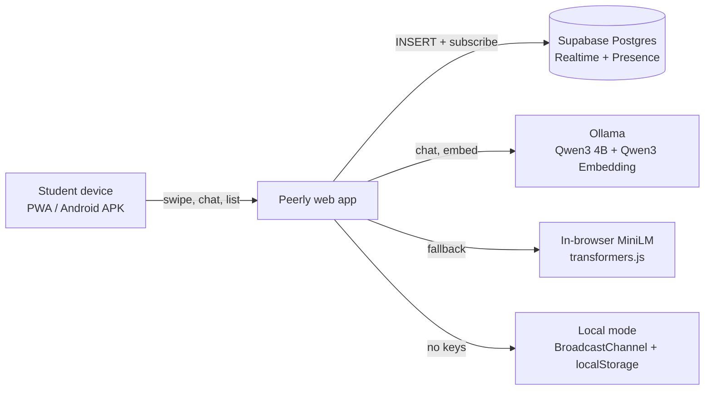

# Peerly

> Your Campus. Your People. Your Marketplace.: a verified-student network to find friends and teammates, swap items, and sell skills, powered by open-source AI and a realtime database.

## Team

**Team Name:** [Team Name]

| Member | Contribution |
| ------ | ------------ |
| [Name] | [Contribution] |
| [Name] | [Contribution] |
| [Name] | [Contribution] |
| [Name] | [Contribution] |

## Problem Statement

### The Problem

New students struggle to find people who share their interests, and everyday campus needs (a laptop, a textbook, a poster designer, a video editor) are scattered across noisy WhatsApp groups. Students who have useful skills and items have no simple way to offer them to peers.

### Why We Chose This Problem

Campus loneliness and student cost-of-living are both real and solvable at campus scale. One app that connects people by interest and lets them trade items and skills addresses both.

## Solution

Peerly combines a Tinder-style discovery experience for **people**, **items** and **skills** with live chat, so students can swipe, match, message and trade inside a campus-only community.

### Key Features

- Swipe discovery of students with interest-based match % and shared-interest highlights
- Campus marketplace and skills marketplace with the same swipe mechanic (swipe right = interested)
- Realtime chat: Campus Lobby group chat, direct messages, live "online now" students
- Open-source AI: semantic search, AI listing / skill-card writer, AI assistant, AI icebreakers
- Groups and events, onboarding with campus-email verification badge, dark mode, installable PWA and Android APK

## Innovation and Differentiation

Most campus apps do either social or marketplace. Peerly puts both behind one swipe interaction and adds semantic (meaning-based) search that runs fully in the browser, so it works without paid AI APIs. Listing and skill cards are written from one sentence by an open-source LLM.

## Technical Implementation

### Architecture



### Technology Stack

| Category | Technologies |
| -------- | ------------ |
| Frontend | HTML, CSS, vanilla JavaScript (single-file PWA), service worker |
| Backend | N/A (client talks directly to Supabase) |
| Database | Supabase (PostgreSQL) with Realtime and Presence; localStorage fallback |
| AI / ML | Qwen3 4B and Qwen3 Embedding 0.6B via Ollama; all-MiniLM-L6-v2 via transformers.js |
| Infrastructure | Netlify (hosting), Capacitor + GitHub Actions (Android APK) |
| APIs / Services | Supabase Realtime, Ollama REST API |

### How It Works

`web/index.html` holds the whole app. A small realtime layer (`RT`) exposes `put`, `all` and `on` and switches between Supabase (INSERT subscriptions for `messages` and `listings`, plus Presence for online users) and a local mode built on `BroadcastChannel`. The AI layer sends chat requests to Ollama when reachable, and otherwise ranks content with cosine similarity over embeddings (Ollama, or in-browser MiniLM). Swiping uses pointer events with a shared drag handler for people and market cards.

### Technical Decisions

- Single-file PWA so judges can open a link with nothing to install; Capacitor wraps the same code as an APK.
- Optional backend: with no keys the app still demos fully (two tabs chat in realtime).
- Open-source models only, with graceful fallback so AI features never hard-fail.
- User-supplied text is escaped before rendering.

## Implementation During the Hackathon

[Describe what the team built during the Hack Day: e.g. swipe discovery, realtime chat layer, marketplace + skills swipe, AI layer, APK pipeline.]

### Team Contributions

- **[Member Name]:** [Contribution]
- **[Member Name]:** [Contribution]
- **[Member Name]:** [Contribution]
- **[Member Name]:** [Contribution]

## Working Application

**Live Application:** https://gregarious-axolotl-c5bb2c.netlify.app

Open the link on a phone and use Add to Home Screen (iOS Safari) or Install (Android Chrome). Test: onboard, swipe people, swipe Market items and Skills, open Campus Lobby, ask the AI tab. Open it on two devices to see live chat. The Android APK is built by GitHub Actions (see Actions tab, artifact `peerly-debug-apk`).

## Demo Video

**Demo Video:** [Video URL]

## Open Source and AI Usage

### AI / Models

- **Qwen3 4B (via Ollama):** AI assistant, listing and skill-card generation, chat icebreakers
- **Qwen3 Embedding 0.6B (via Ollama):** semantic search and matching
- **all-MiniLM-L6-v2 (transformers.js):** in-browser embeddings fallback

### Open Source Components

- **Supabase:** realtime Postgres database and presence
- **Ollama:** local model runtime
- **Transformers.js:** in-browser ML
- **Capacitor:** Android packaging

## Setup and Usage

### Prerequisites

- A browser (to run the web app)
- Optional: Node.js 18+, Ollama, a free Supabase project

### Installation

```
git clone [repository-url]
cd [project-directory]
npm install
```

### Environment Variables

None. Keys are entered in the app under Profile > Backend & AI (stored on the device).

### Running the Project

```
npm run serve
```

Realtime database: run `supabase/schema.sql` in the Supabase SQL editor, then paste the project URL and anon key in the app.
AI: `ollama pull qwen3:4b && ollama pull qwen3-embedding:0.6b && OLLAMA_ORIGINS="*" ollama serve`.
Android APK: push to GitHub and download `peerly-debug-apk` from the Actions tab, or run `npm run android:add && npm run android:open` with Android Studio.

### Usage

Create a profile, pick interests, swipe on People and Market, chat in Messages, and use the AI tab.

## Devpost Submission

**Devpost Project:** [Devpost Project URL]

## Credits and License

### Credits

Supabase, Ollama, Qwen (Alibaba), Hugging Face / Xenova transformers.js, Capacitor. Code written with assistance from Claude (Anthropic).

### License

MIT, see [LICENSE](LICENSE).

## Submission Checklist

- [ ] Project title and description added
- [ ] All team members listed
- [ ] Problem clearly explained
- [ ] Reason for choosing the problem explained
- [ ] Solution and key features documented
- [ ] Innovation and differentiation explained
- [ ] Architecture included
- [ ] Technical implementation documented
- [ ] Work completed during the hackathon documented
- [ ] Team contributions documented
- [ ] Working application is functional
- [ ] Live application link added where applicable
- [ ] Demo video added
- [ ] AI and open-source components documented
- [ ] Setup and usage instructions tested
- [ ] Challenges and learnings documented
- [ ] Devpost submission completed
- [ ] Devpost link added
- [ ] Credits added
- [ ] License added
- [ ] Repository is organized and complete
